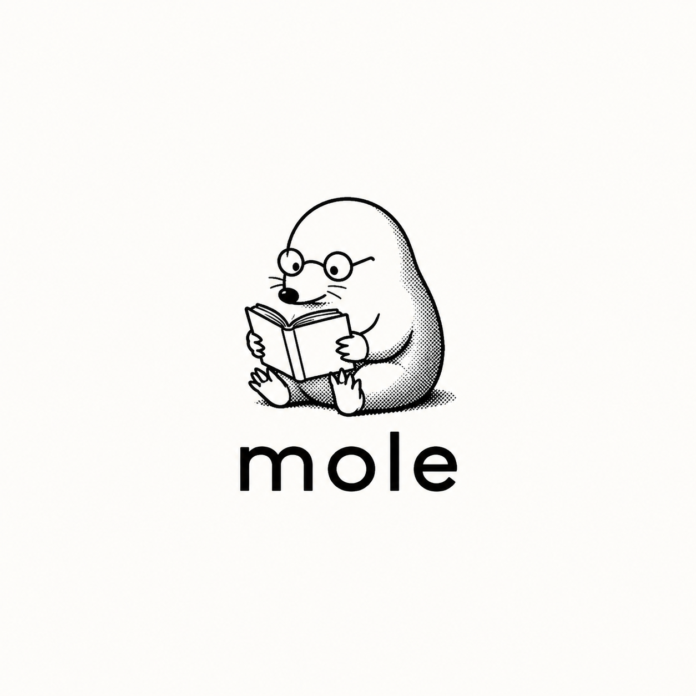

<div align="center">
  
</div>

# mole

_Burrow through your documents. Find what matters._


A document intelligence backend that ingests files, carves them into chunks, builds vector embeddings, and lets you search across collections or your entire knowledge base — semantic, not just keyword.

## How it works

```
              ┌─────────────┐
              │  Upload     │
              │  document   │
              └──────┬──────┘
                     │
              ┌──────▼──────┐
              │   Chunk     │
              │   & embed   │
              └──────┬──────┘
                     │
              ┌──────▼──────┐
              │   Store     │
              │   vectors   │
              └──────┬──────┘
                     │
              ┌──────▼──────┐
              │  Search     │
              │  (semantic) │
              └─────────────┘
```

Organize documents into **collections**. Query across one collection or your entire pool. The vectors speak first; the raw text backs them up.

## Stack

| Layer | What |
|-------|------|
| **Database** | PostgreSQL + pgvector |
| **Auth** | Supabase Auth |
| **Storage** | Supabase Storage (documents bucket) |
| **API** | Deno Edge Functions |
| **Frontend** | Vue (coming) |

## Project structure

```
supabase/
├── config.toml                  # Project config
├── seed.sql                     # Seed data
├── migrations/
│   └── *_initial_tables.sql     # Schema: users, collections, documents, chunks
└── functions/
    ├── _shared/                 # Shared utilities
    │   ├── fetch_wrapper.ts     #    Auth wrapper & error handling
    │   ├── response_types.ts    #    Standardized API responses
    │   ├── route_utils.ts       #    URL parameter parsing
    │   ├── validator_utils.ts   #    Validation helpers
    │   └── types/
    │       └── database.types.ts
    ├── collection/              # Collections CRUD
    │   ├── index.ts
    │   ├── daf.ts
    │   ├── types.ts
    │   └── deno.json
    └── document/                # Documents CRUD
        ├── index.ts
        ├── daf.ts
        ├── types.ts
        └── deno.json
```

## Database

| Table | Role |
|-------|------|
| **users** | Extends `auth.users` with profile info & storage path |
| **collections** | Groups of documents, soft-deletable |
| **documents** | Uploaded files with status & chunking strategy |
| **chunks** | Text fragments with pgvector embeddings (1536d), linked-list traversal |
| **document_status** | Processing status lookup |
| **chunking_strategy** | Chunking method lookup |

## API

### Collections

| Method | Path | What |
|--------|------|------|
| `GET` | `/collection` | List all collections |
| `GET` | `/collection/:id` | Get one collection |
| `POST` | `/collection` | Create a collection |
| `PATCH` | `/collection/:id` | Update a collection |
| `DELETE` | `/collection/:id` | Soft-delete a collection |

### Documents

| Method | Path | What |
|--------|------|------|
| `GET` | `/document` | List all documents (with status & strategy) |
| `GET` | `/document/:id` | Get one document |
| `POST` | `/document` | Upload a document (multipart) |
| `DELETE` | `/document/:id` | Remove document + storage file |

## Getting started

### Prerequisites

- [Supabase CLI](https://supabase.com/docs/guides/local-development/cli)
- [Docker](https://docs.docker.com/get-docker/)

### Local

```bash
supabase start              # Boot local Supabase stack
supabase db push            # Apply migrations
supabase functions serve    # Serve edge functions
```

### Deploy

```bash
supabase link --project-ref <project-id>
supabase db push
supabase functions deploy collection
supabase functions deploy document
```

## License

[MIT](./LICENSE)

---

_Personal tooling. Dig your own tunnels._
